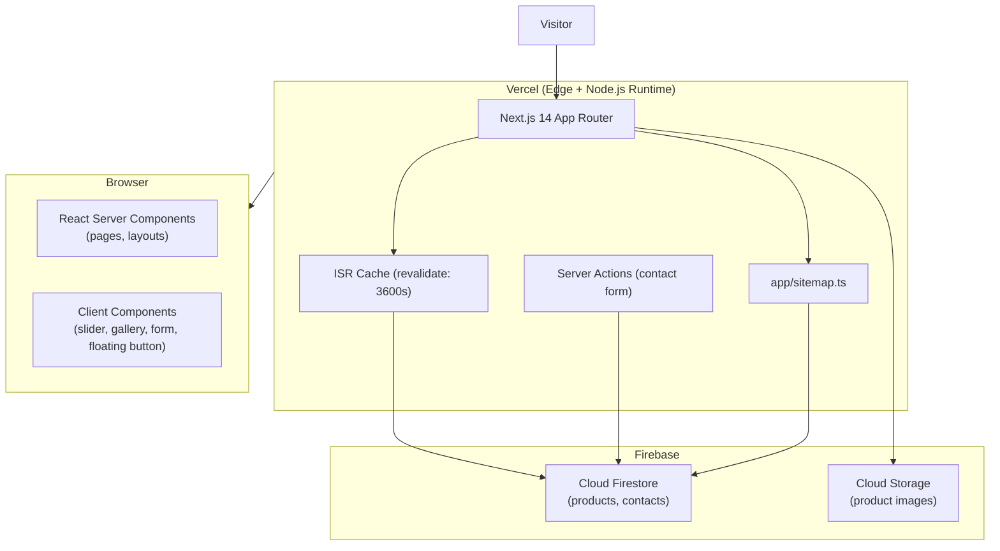

# Design Document — logika-web

## Overview

Logika Web is a visual digital catalog and lead-generation website for Logika Decoración, a custom furniture manufacturer in Bogotá, Colombia. The primary conversion action is a WhatsApp contact — there is no cart, checkout, or payment flow.

The site is built with **Next.js 14 (App Router) + TypeScript**, styled with **Tailwind CSS**, backed by **Firebase Firestore and Firebase Storage**, and hosted on **Vercel**. The architecture is intentionally designed to be extensible toward future e-commerce (cart, variants, checkout) without requiring structural rework.

### Goals

- Fast, visually premium catalog experience inspired by aristas.co
- Maximum Lighthouse/Core Web Vitals scores on mobile 4G
- Zero server-maintenance: fully serverless on Vercel + Firebase
- Business owner can add/edit products in Firestore without code deployment
- SEO-ready for Bogotá furniture searches

### Non-Goals (v1)

- Shopping cart, checkout, payment gateway
- Product variants (fabric selector)
- Blog, testimonials, budget calculator
- Search functionality
- User authentication

---

## Architecture

### High-Level System Diagram



### Rendering Strategy

| Route | Strategy | Rationale |
|---|---|---|
| `/` | ISR (`revalidate: 3600`) | Featured products change rarely |
| `/catalogo` | ISR (`revalidate: 3600`) | Product list, stable data |
| `/catalogo/[slug]` | ISR + `generateStaticParams` | Pre-build known slugs, regenerate hourly |
| `/nosotros` | Static | Content never changes at runtime |
| `/contacto` | Static | Form submits via Server Action |
| `sitemap.xml` | ISR (`revalidate: 86400`) | Regenerate daily |

### Firebase SDK Split

The architecture uses a **dual SDK pattern** to keep credentials server-side only:

- **Firebase Admin SDK** (`firebase-admin`) — used exclusively in Server Components, Server Actions, and `app/sitemap.ts`. Initialized once via a singleton in `lib/firebase/admin.ts`. Credentials stored in Vercel environment variables (no `NEXT_PUBLIC_` prefix).
- **No client-side Firebase SDK** — all Firestore reads are done server-side. Contact form submissions go through a Server Action that uses the Admin SDK. This means no Firebase config is ever shipped to the browser.

### Directory Structure

```
app/
  layout.tsx              # Root layout: Header, Footer, WhatsAppButton
  page.tsx                # Home (ISR)
  catalogo/
    page.tsx              # Catalog gallery (ISR)
    [slug]/
      page.tsx            # Product detail (ISR + generateStaticParams)
  nosotros/
    page.tsx              # About (static)
  contacto/
    page.tsx              # Contact (static, Server Action)
  sitemap.ts              # Dynamic sitemap
  robots.ts               # robots.txt

lib/
  firebase/
    admin.ts              # Admin SDK singleton
  firestore/
    products.ts           # getProduct(slug), getAllProducts(), getProductsByCategory()
    contacts.ts           # saveContact(data)

components/
  layout/
    Header.tsx            # 'use client' for mobile menu state
    Footer.tsx
    WhatsAppButton.tsx    # 'use client' for fixed positioning
  home/
    HeroSlider.tsx        # 'use client' (auto-slide, interaction)
    CategorySection.tsx
    DifferentiatorsSection.tsx
  catalog/
    ProductGrid.tsx
    ProductCard.tsx
    CategoryFilter.tsx    # 'use client' (filter state)
  product/
    ProductGallery.tsx    # 'use client' (thumbnail selection)
  contact/
    ContactForm.tsx       # 'use client' (form state, validation)
  ui/
    LazyImage.tsx         # next/image wrapper with lazy loading
    WhatsAppLink.tsx      # Reusable wa.me link builder

types/
  product.ts
  contact.ts

constants/
  categories.ts           # CATEGORIES array (single source of truth)
  whatsapp.ts             # DEFAULT_WHATSAPP_MSG

```

---

## Components and Interfaces

### Layout Components

#### `Header`

Client Component (hamburger menu toggle requires client state).

```typescript
interface HeaderProps {
  // no props — reads from constants/routes
}
```

- Dark background `#212121`, white text
- Logo centered (SVG or next/image)
- Nav links: Inicio, Catálogo, Nosotros, Contacto
- Social icons: Instagram, WhatsApp
- Hamburger menu on `< 768px` — renders nav links in a mobile overlay

#### `Footer`

Server Component.

- Same logo, brief description, nav links, social icons
- Contact information, copyright notice

#### `WhatsAppButton`

Client Component (needs `window` for rendering, sticky scroll behavior).

```typescript
interface WhatsAppButtonProps {
  message?: string  // defaults to DEFAULT_WHATSAPP_MSG from constants
}
```

- Fixed position `bottom-6 right-6`
- `z-50` to float above all content
- `aria-label="Contactar por WhatsApp"`
- Opens `https://wa.me/57XXXXXXXXXX?text=...` in new tab

### Home Page Components

#### `HeroSlider`

Client Component.

```typescript
interface HeroSliderProps {
  slides: { imageUrl: string; tagline?: string }[]
  autoSlideInterval?: number  // default 5000ms
}
```

- `h-screen` full viewport height
- Navigation arrows (prev/next)
- Slide indicator dots
- Auto-advances; pauses on hover
- Uses `next/image` with `priority` on the first slide (LCP optimization)

#### `CategorySection`

Server Component. Receives static category list.

```typescript
interface CategorySectionProps {
  categories: Category[]
  mosaicImages: { src: string; alt: string }[]
}
```

- Left column: text links to `/catalogo?categoria=<slug>`
- Right column: asymmetric mosaic grid of lifestyle photos (CSS grid)

#### `DifferentiatorsSection`

Server Component.

```typescript
interface Differentiator {
  icon: string    // SVG path or lucide icon name
  heading: string
  body: string
}

interface DifferentiatorsSectionProps {
  items: Differentiator[]
}
```

### Catalog Components

#### `CategoryFilter`

Client Component (URL search param management).

```typescript
interface CategoryFilterProps {
  categories: Category[]
  selected: string | null
}
```

- On mobile: horizontal scrollable pill row
- On desktop: vertical sidebar list
- Updates URL via `router.push` with `?categoria=<value>` to enable shareable filtered URLs
- "Todos" option clears the filter

#### `ProductGrid`

Server Component.

```typescript
interface ProductGridProps {
  products: Product[]
}
```

- CSS grid: `grid-cols-1 sm:grid-cols-2 lg:grid-cols-3`
- Maps products to `ProductCard`
- Shows empty state message when `products.length === 0`

#### `ProductCard`

Server Component.

```typescript
interface ProductCardProps {
  product: Product
}
```

- `next/image` with `loading="lazy"`, WebP via `next/image` automatic format conversion
- Product name (serif heading)
- Description truncated to 120 characters with CSS `line-clamp-3`
- Entire card is an `<a href="/catalogo/[slug]">`

### Product Detail Components

#### `ProductGallery`

Client Component (thumbnail selection state).

```typescript
interface ProductGalleryProps {
  images: string[]   // Firebase Storage URLs
  productName: string
}
```

- Layout: thumbnail strip on left (vertical), large main image in center
- `useState` for selected image index
- When `images.length < 2`: renders single image, no thumbnail strip, no navigation arrows
- Keyboard navigable (left/right arrows)

### Contact Components

#### `ContactForm`

Client Component with Server Action for submission.

```typescript
interface ContactFormData {
  name: string          // required, max 100 chars
  phone: string         // required, Colombian: 10 digits starting with 3
  productInterest: string  // required, one of CATEGORIES + "Otro"
  message: string       // required, max 500 chars
}
```

- Client-side validation runs on submit before calling Server Action
- Field-level error display; preserves entered values on error
- Shows success confirmation on Server Action success
- Shows retry-able error message on Server Action failure

### Shared UI

#### `LazyImage`

Thin wrapper around `next/image` enforcing `loading="lazy"` for below-fold images. First slide in HeroSlider uses `priority` directly instead.

#### `WhatsAppLink`

```typescript
function buildWhatsAppUrl(phone: string, message: string): string
// Returns: https://wa.me/{phone}?text={encodeURIComponent(message)}
```

Pure function, used by both `WhatsAppButton` and product page CTA.

---

## Data Models

### Firestore: `products` Collection

```typescript
interface Product {
  id: string             // document ID = URL slug (e.g., "sofa-oslo-gris")
  name: string
  category: CategorySlug // "sofas" | "camas" | "comedores" | "sofacamas" | "cortinas" | "sillas" | "medida"
  description: string
  materials: string[]
  images: string[]       // Firebase Storage download URLs (HTTPS)
  featured: boolean      // appears on Home page featured section
  whatsappMsg: string    // pre-filled message for product WhatsApp CTA
  createdAt: Timestamp
}
```

**Category slug mapping:**

| Display Name | Slug |
|---|---|
| Sofás | `sofas` |
| Camas | `camas` |
| Comedores | `comedores` |
| Sofacamas | `sofacamas` |
| Cortinería | `cortinas` |
| Sillas | `sillas` |
| Diseños a medida | `medida` |

This mapping lives in `constants/categories.ts` as the single source of truth — UI labels, URL params, and Firestore values all derive from it.

**Firestore Indexes required:**
- Composite: `category ASC, createdAt DESC` (for filtered catalog)
- Single: `featured == true` (for home page featured products)

### Firestore: `contacts` Collection

```typescript
interface ContactSubmission {
  name: string
  phone: string           // stored as string (leading zero preserved)
  productInterest: string // CategorySlug | "otro"
  message: string
  createdAt: Timestamp    // set server-side via Admin SDK
  userAgent?: string      // optional, for spam detection
}
```

Contact submissions are write-only from the website. Business owner reads them in the Firebase console.

### Firestore Security Rules

```
rules_version = '2';
service cloud.firestore {
  match /databases/{database}/documents {
    // Products: public read, no client write
    match /products/{productId} {
      allow read: if true;
      allow write: if false;  // Admin SDK only
    }
    // Contacts: no client read, write only (rate-limited via Server Action)
    match /contacts/{contactId} {
      allow read: if false;
      allow write: if false;  // Admin SDK only
    }
  }
}
```

Since all access goes through the Admin SDK (Server Components / Server Actions), these rules deny all client SDK access as an additional security layer.

### Environment Variables

```
# Vercel Environment Variables (no NEXT_PUBLIC_ prefix — server-only)
FIREBASE_PROJECT_ID=
FIREBASE_CLIENT_EMAIL=
FIREBASE_PRIVATE_KEY=
FIREBASE_STORAGE_BUCKET=

# WhatsApp Business phone (server-side, used in Server Actions)
WHATSAPP_PHONE=57XXXXXXXXXX
```

No Firebase config is exposed to the client browser.

### TypeScript Types

```typescript
// types/product.ts
export type CategorySlug = 
  | "sofas" | "camas" | "comedores" | "sofacamas" 
  | "cortinas" | "sillas" | "medida";

export interface Product {
  id: string;
  name: string;
  category: CategorySlug;
  description: string;
  materials: string[];
  images: string[];
  featured: boolean;
  whatsappMsg: string;
  createdAt: Date;
}

// types/contact.ts
export interface ContactFormData {
  name: string;
  phone: string;
  productInterest: string;
  message: string;
}

export interface ContactSubmission extends ContactFormData {
  createdAt: Date;
}
```

---

## SEO Architecture

### Per-Page Metadata

Each page exports a `generateMetadata` function (or static `metadata` object):

```typescript
// app/catalogo/[slug]/page.tsx
export async function generateMetadata({ params }: Props): Promise<Metadata> {
  const product = await getProduct(params.slug);
  return {
    title: `${product.name} | Logika Decoración`,           // ≤ 60 chars
    description: product.description.substring(0, 155),      // ≤ 160 chars
    openGraph: {
      title: `${product.name} | Logika Decoración`,
      description: product.description.substring(0, 155),
      images: [{ url: product.images[0] }],
      url: `https://logikadecoracion.com/catalogo/${product.id}`,
      type: "website",
    },
    alternates: {
      canonical: `https://logikadecoracion.com/catalogo/${product.id}`,
    },
  };
}
```

### Dynamic Sitemap (`app/sitemap.ts`)

```typescript
export const revalidate = 86400; // regenerate daily

export default async function sitemap(): Promise<MetadataRoute.Sitemap> {
  const products = await getAllProducts();
  const staticRoutes = ["/", "/catalogo", "/nosotros", "/contacto"];
  
  const productRoutes = products.map(p => ({
    url: `https://logikadecoracion.com/catalogo/${p.id}`,
    lastModified: p.createdAt,
    changeFrequency: "monthly" as const,
    priority: 0.8,
  }));

  const staticEntries = staticRoutes.map(route => ({
    url: `https://logikadecoracion.com${route}`,
    changeFrequency: "monthly" as const,
    priority: route === "/" ? 1.0 : 0.7,
  }));

  return [...staticEntries, ...productRoutes];
}
```

### Schema.org LocalBusiness (Root Layout)

```tsx
// app/layout.tsx — injected as JSON-LD script
const localBusinessSchema = {
  "@context": "https://schema.org",
  "@type": "LocalBusiness",
  "name": "Logika Decoración",
  "description": "Fábrica de muebles a medida en Bogotá, Colombia",
  "address": {
    "@type": "PostalAddress",
    "addressLocality": "Bogotá",
    "addressCountry": "CO"
  },
  "geo": {
    "@type": "GeoCoordinates",
    "latitude": 4.7110,
    "longitude": -74.0721
  },
  "telephone": "+57XXXXXXXXXX",
  "url": "https://logikadecoracion.com"
};
```

---

## Visual System

### Color Palette

| Token | Value | Usage |
|---|---|---|
| `primary` | `#212121` | Nav background, headings, body text |
| `accent` | `#00BCD4` | CTAs, highlights, links, icon accents |
| `bg-base` | `#FFFFFF` | Page background |
| `bg-subtle` | `#FAFAFA` | Section alternating backgrounds |
| `text-muted` | `#6B7280` | Secondary text, captions |
| `border` | `#E5E7EB` | Dividers, card borders |

All color pairs meet WCAG 2.1 AA contrast (4.5:1 for normal text, 3:1 for large):
- `#212121` on `#FFFFFF`: 16.1:1 ✓
- `#FFFFFF` on `#212121`: 16.1:1 ✓ (nav bar text)
- `#00BCD4` on `#212121`: 3.4:1 (large text / decorative only — not used for body text)
- `#6B7280` on `#FFFFFF`: 4.6:1 ✓

### Typography

```css
/* Tailwind config extension */
fontFamily: {
  heading: ['Playfair Display', 'Georgia', 'serif'],
  body: ['Inter', 'system-ui', 'sans-serif'],
}
```

Loaded via `next/font/google` (subset to latin + latin-ext for Colombian Spanish).

| Scale | Font | Usage |
|---|---|---|
| `text-4xl` / `text-5xl` | Playfair Display | Hero tagline, page titles |
| `text-2xl` / `text-3xl` | Playfair Display | Section headings |
| `text-xl` | Playfair Display | Product names |
| `text-base` | Inter | Body text, descriptions |
| `text-sm` | Inter | Captions, labels, nav links |

### Spacing

Standard 8px grid via Tailwind defaults. Key spacing decisions:
- Nav height: `h-16` (64px)
- Section vertical padding: `py-16` (64px) desktop, `py-10` (40px) mobile
- Product card gap: `gap-6` (24px)
- Container max-width: `max-w-7xl mx-auto px-4 sm:px-6 lg:px-8`

---

## Correctness Properties

*A property is a characteristic or behavior that should hold true across all valid executions of a system — essentially, a formal statement about what the system should do. Properties serve as the bridge between human-readable specifications and machine-verifiable correctness guarantees.*

The following properties were derived from prework analysis of the acceptance criteria. PBT is appropriate here because the core logic — filter functions, URL constructors, validation functions, metadata generators — are pure functions with meaningful input variation.

### Property 1: Category filter returns only matching products

*For any* category slug and any array of products, applying the category filter should return only products whose `category` field equals the selected category slug.

**Validates: Requirements 2.2**

### Property 2: ProductCard renders required fields and truncates description

*For any* product object, the rendered `ProductCard` should contain the product's name, include an image element, and display a description of at most 120 characters.

**Validates: Requirements 2.3**

### Property 3: Product URL slug construction

*For any* product with a valid `id` (slug), the `ProductCard` anchor `href` should equal `/catalogo/${product.id}`.

**Validates: Requirements 2.5, 3.1**

### Property 4: ProductPage renders all product data fields

*For any* product object, the rendered product detail page should contain the product name, the full description, and all items from the materials list.

**Validates: Requirements 3.5**

### Property 5: WhatsApp URL encodes product message correctly

*For any* product with any `whatsappMsg` string, the WhatsApp CTA `href` generated by `buildWhatsAppUrl` should include the URL-encoded form of the `whatsappMsg` value.

**Validates: Requirements 3.6**

### Property 6: Product page metadata contains product name and description

*For any* product, `generateMetadata(product)` should return a `title` that contains the product name and a `description` that is derived from the product description.

**Validates: Requirements 3.7**

### Property 7: Contact form phone validation — Colombian format

*For any* string input, `validatePhone(input)` should return `true` if and only if the string consists of exactly 10 digits and the first digit is `3`.

**Validates: Requirements 5.3**

### Property 8: Contact form preserves valid field values on partial submission

*For any* contact form state where some fields are valid and others are invalid, submitting the form should display error messages only for the invalid fields, and the valid fields should retain their entered values.

**Validates: Requirements 5.5**

### Property 9: SEO metadata length constraints

*For any* page data object, `generatePageMetadata(data)` should return a `title` of at most 60 characters and a `description` of at most 160 characters.

**Validates: Requirements 9.1**

### Property 10: Sitemap includes all product URLs

*For any* array of products returned from Firestore, `generateSitemap(products)` should include a URL entry `/catalogo/${product.id}` for every product in the array, and no product should be omitted.

**Validates: Requirements 9.2**

### Property 11: Open Graph tags completeness

*For any* page, the generated metadata should include all five required Open Graph fields: `og:title`, `og:description`, `og:image`, `og:url`, and `og:type`.

**Validates: Requirements 9.3**

### Property 12: Canonical URL matches page path

*For any* page route, the canonical URL in the generated metadata should equal `https://logikadecoracion.com${route}`.

**Validates: Requirements 9.5**

---

## Error Handling

### Product Not Found (`/catalogo/[slug]`)

When `getProduct(slug)` returns `null` (slug not in Firestore), the page component calls `notFound()` from `next/navigation`, which renders Next.js's built-in 404 page customized via `app/not-found.tsx`. The custom 404 shows a message in Spanish and a link back to `/catalogo`.

```typescript
// app/catalogo/[slug]/page.tsx
const product = await getProduct(params.slug);
if (!product) notFound();
```

### Firestore Read Failures

Server Component data fetching is wrapped in try/catch. On failure, pages display a graceful error state with a "Intenta de nuevo" message rather than crashing. For ISR pages, stale cache is served if the revalidation fetch fails (Next.js default behavior).

### Contact Form Submission Failure

The Server Action returns a typed result discriminant:

```typescript
type ActionResult =
  | { status: "success" }
  | { status: "error"; message: string };
```

On `"error"`, the `ContactForm` client component displays the error message and keeps the form data intact so the visitor can retry.

### Firebase Storage Image Failures

`next/image` is configured with a `placeholder="blur"` (blurDataURL generated at build time for static images, or a default blur for dynamic Firebase URLs). If an image fails to load, `next/image` renders its built-in broken image state. Alt text is always present.

### Firestore Admin SDK Initialization

The Admin SDK singleton in `lib/firebase/admin.ts` checks `getApps().length` before calling `initializeApp()` to prevent re-initialization in hot-reload scenarios on Vercel.

---

## Testing Strategy

### Dual Testing Approach

Both unit/example tests and property-based tests are used:

- **Unit tests**: specific examples, edge cases, and component rendering verification
- **Property tests**: universal properties across randomly generated inputs (Properties 1–12 above)
- **Integration tests**: Firestore read/write via mock Admin SDK
- **Smoke tests**: key rendering and configuration checks

### Test Setup

**Framework**: Jest + React Testing Library for unit/component tests  
**Property-based testing**: [fast-check](https://github.com/dubzzz/fast-check) (TypeScript-native, excellent Next.js ecosystem compatibility)  
**Accessibility**: jest-axe for automated a11y checks  
**E2E** (optional, future): Playwright for critical paths

Install:
```bash
npm install --save-dev jest @testing-library/react @testing-library/jest-dom fast-check jest-axe
```

### Property Test Configuration

Each property test runs a minimum of **100 iterations** via fast-check's default runner. Each test is tagged with a comment referencing the design property.

```typescript
// Example: Property 1
import fc from "fast-check";

// Feature: logika-web, Property 1: Category filter returns only matching products
test("filterProducts returns only matching category", () => {
  fc.assert(
    fc.property(
      fc.constantFrom("sofas", "camas", "comedores", "sofacamas", "cortinas", "sillas", "medida"),
      fc.array(fc.record({
        id: fc.string(),
        name: fc.string(),
        category: fc.constantFrom("sofas", "camas", "comedores", "sofacamas", "cortinas", "sillas", "medida"),
        // ...other fields
      })),
      (category, products) => {
        const result = filterProducts(category, products);
        return result.every(p => p.category === category);
      }
    ),
    { numRuns: 100 }
  );
});
```

### Unit Tests

- `CategoryFilter`: renders correct number of pills, "Todos" resets filter
- `ProductCard`: renders name, image, truncated description
- `ProductGallery`: hides navigation when `images.length < 2`; shows nav when `images.length >= 2`
- `Header`: hamburger menu toggles nav overlay on mobile
- `ContactForm`: shows success state after successful Server Action mock
- `WhatsAppButton`: `aria-label` present; `href` matches expected URL

### Integration Tests (mocked Admin SDK)

- `getProduct(slug)` returns `null` for non-existent slug
- `saveContact(data)` calls `adminDb.collection("contacts").add(...)` with correct fields + server timestamp

### Accessibility Tests (jest-axe)

- Run `axe()` on `<ProductCard />`, `<ContactForm />`, `<Header />`, `<WhatsAppButton />`
- Assert zero violations at WCAG 2.1 AA level

### Performance Strategy (not unit-testable)

- Lighthouse CI in Vercel preview deployments (GitHub Actions)
- Target: LCP < 2.5s on simulated 4G
- Key optimizations enforced by architecture:
  - `next/image` automatic WebP conversion and `srcset`
  - `priority` on hero image (LCP element)
  - `loading="lazy"` on all below-fold images
  - No client-side Firebase SDK bundle
  - `next/font` for zero layout shift on font load

---

## Future Extensibility Notes

The data model and component architecture deliberately avoids blocking future features:

| Future Feature | How Architecture Supports It |
|---|---|
| Product variants (fabric) | Add `variants: Variant[]` to `Product` type; `ProductGallery` already maps images by index |
| E-commerce cart | `CartContext` client provider wraps layout; no server data model changes needed |
| Checkout + payment | New `/checkout` route; `Product.price` field added to Firestore |
| Blog | New `/blog` route and `posts` Firestore collection; same ISR pattern |
| Testimonials | New `testimonials` Firestore collection; `TestimonialsSection` on Home |
| Budget calculator | New client component, no data model changes |
| Search | Algolia/Typesense index fed by Firestore triggers; `SearchBar` client component added to Header |
